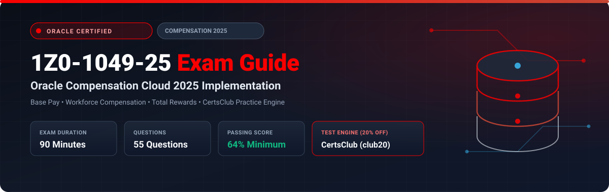

  

# Oracle Compensation Cloud 2025 Implementation Professional (1Z0-1049-25) Exam Study Guide & Practice Test Resource Portal

[-f80000?style=for-the-badge&logo=oracle&logoColor=white)](https://education.oracle.com/)
[-f80000?style=for-the-badge&logo=oracle)](https://education.oracle.com/)

[-28a745?style=for-the-badge&logo=shield)](https://www.certsclub.com/oracle/)

---

## 1. Exam Overview & Candidate Profile

The **Oracle Compensation Cloud 2025 Implementation Professional (1Z0-1049-25)** exam certifies that an implementation specialist possesses the expertise required to configure and manage Oracle Fusion Cloud Compensation. The exam tests candidates on designing Base Pay structures, Individual Compensation Plans (ICPs), Workforce Compensation cycles (annual merit reviews, bonus allocations, budgeting, worksheet layouts), Total Compensation Statements, and Fast Formulas.

Passing 1Z0-1049-25 awards the **Oracle Compensation Cloud 2025 Certified Implementation Professional** credential.

### Target Candidate Profile & Career Roles
* **Compensation Functional Consultants & Implementation Leads**
* **Total Rewards Systems Specialists**
* **HCM Cloud Compensation Architects**

---

## 2. Key Exam Specifications

| Parameter | Official Specification |
| :--- | :--- |
| **Exam Code** | 1Z0-1049-25 |
| **Exam Title** | Oracle Compensation Cloud 2025 Implementation Professional |
| **Associated Credential** | Oracle Compensation Cloud 2025 Certified Implementation Professional |
| **Duration** | 90 Minutes |
| **Number of Questions** | 55 Questions |
| **Passing Score** | 64% |
| **Question Format** | Multiple Choice (Single and Multiple Select) |
| **Delivery Vendor** | Pearson VUE / Oracle University Online Remote Proctoring |
| **Recommended Practice Test Engine** | **[1Z0-1049-25 Practice Test - CertsClub](https://www.certsclub.com/oracle/)** (Coupon: `club20` for 20% off) |

---

## 3. Official Blueprint & Exam Domain Breakdown

| Domain Code | Domain Title | Weighting | Key Competencies Covered |
| :--- | :--- | :---: | :--- |
| **1.0** | **Base Pay & Salary Structures** | **20%** | Salary Basis setup, Grade Rates, Salary Components, Differential Profiles, Progression Grade Ladders. |
| **2.0** | **Individual Compensation Plans (ICP)** | **20%** | Creating ICPs, Plan access and eligibility, Personal contributions, Spot bonuses, Off-cycle payments. |
| **3.0** | **Workforce Compensation Architecture** | **30%** | Plan cycles, Eligibility profiles, Budgets (top-down, bottom-up), Worksheet configuration, Dynamic columns, Model allocations, Alerts. |
| **4.0** | **Total Compensation Statements** | **15%** | Statement definitions, Compensation items, Categories, Subcategories, Display layouts. |
| **5.0** | **Fast Formulas & Administration** | **15%** | Fast Formula types for Compensation (Default, Override, Validation), Batch cycle execution, Posting to HR and Payroll. |

---

## 4. Scenario-Based Demo Question & Explanation

### Question 1: Workforce Compensation Dynamic Columns
**Scenario:** During an annual salary review cycle, managers need a column on their worksheet that calculates a recommended merit increase percentage based on the employee's performance rating and their position within the salary range (compa-ratio).

Which mechanism should be configured on the Workforce Compensation Worksheet?

A) Static Text Attribute  
B) Dynamic Calculation Column utilizing conditional expressions or a Compensation Default Fast Formula  
C) BIP Custom Data Model  
D) Standard Salary Basis Formula  

**Correct Answer:** **B**

**Detailed Explanation:**
* In Oracle Workforce Compensation, **Dynamic Columns** evaluate row-level conditions dynamically on the manager worksheet. Configuring dynamic logic (or linking a Fast Formula) allows values like recommended merit percentages to auto-populate based on live inputs such as performance rating and compa-ratio.

---

## 5. Recommended Preparation Strategy & Practice Testing Engine

1. **Build a Complete Compensation Cycle:** Set up salary bases, an individual bonus plan, and an annual workforce compensation plan with budgeting and dynamic worksheet columns.
2. **Practice with Full-Length Mock Exams:** Use **[CertsClub Oracle 1Z0-1049-25 Practice Tests](https://www.certsclub.com/oracle/)**.
   * High-yield questions on budgeting, worksheet design, and formula parameters.
   * Enter discount coupon code **`club20`** at checkout on [CertsClub](https://www.certsclub.com/oracle/) for an immediate 20% discount.

---

## 6. Official Documentation & References

* [Oracle Fusion Cloud Compensation Documentation](https://docs.oracle.com/en/cloud/saas/human-resources/compensation/)
* [Oracle University 1Z0-1049-25 Exam Details](https://education.oracle.com/)
* [CertsClub 1Z0-1049-25 Practice Engine](https://www.certsclub.com/oracle/)
